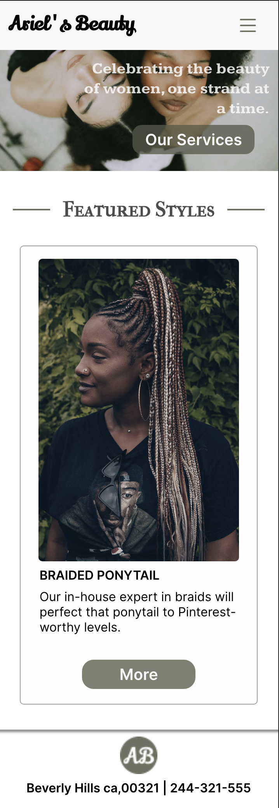

# Ariel's Beauty - Passion Project

## Live Site
- [Ariel's Beauty]()

## Table of contents

- [Overview](#overview)
  - [The challenge](#the-challenge)
  - [Screenshot](#screenshot)
  - [My process](#my-process)
  - [Built with](#built-with)
  - [What I learned](#what-i-learned)
  - [Continued development](#continued-development)
  - [Useful resources](#useful-resources)
- [Author](#author)
- [Acknowledgments](#acknowledgments)
## Overview

This app consists of various technologies such as React, Tailwind CSS, and many more. The application primarily features two main functionalities: booking and payment. [Click here for a deeper insight into the process](./ariels-beauty-app/src/assets/stuff/process.md)

### The challenge

- Build a functional stylist website where consumers can book appointments and make payments.

### Screenshot

## My process

### Built with

- React + Vite
- TailwindCSS
- Mobile first workflow
- Flexbox
- Splidejs
- Emailjs
### What I learned

### Continued development

### Useful resources

## Author

- Twitter - [@kiarahoheb](https://www.twitter.com/kiarahoheb)
- LinkedIn - [@kiarahoheb](https://www.linkedin.com/in/kiara-hoheb-641157244/)

## Acknowledgments

I would like to give credit to [cupcakesandcashmere](https://cupcakesandcashmere.com/page/about) for inspiring me through their About page.